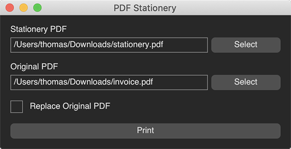

# PDF Stationery

When you are running a business, you usually print all your letters, invoices, and other correspondence onto your stationery. So you can comply with your company's corporate identity.

But when you are creating PDF documents out of MS Word or any business software system, you often cannot make it use the exact stationery which you spent so much money for.

This little program solves that problem. Take your stationery as a PDF plus the PDF document you want to send out through email or any other digital channel, and merge them. Done. Your document is "printed onto your stationery," as it would have when using your physical office printer.

(The idea isn't new. I wrote [the first version](https://github.com/aspnetde/69Grad.PDF.Merge) of this little program in 2009 for myself. PDF Stationery is just a modern re-implementation that also can deal with more PDF formats than the ancient one.)

---

App Icon by [Ant Design SVG Icons](https://github.com/ant-design/ant-design-icons).

---

Packaging for macOS:

- `dotnet restore -r osx-x64`
- `dotnet msbuild -t:BundleApp -p:RuntimeIdentifier=osx-x64 -property:Configuration=Release`